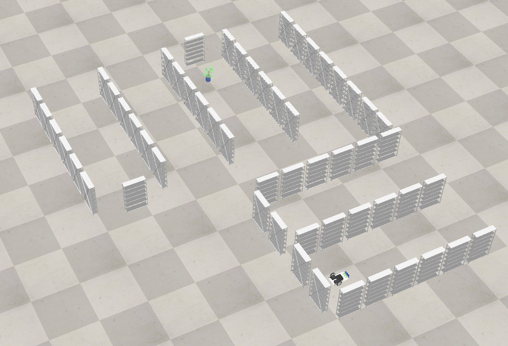
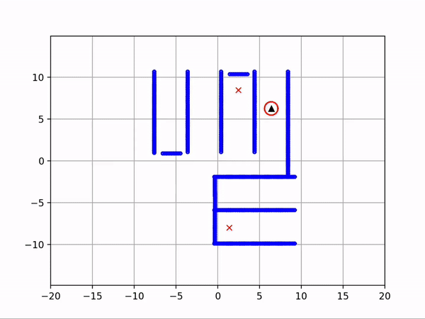
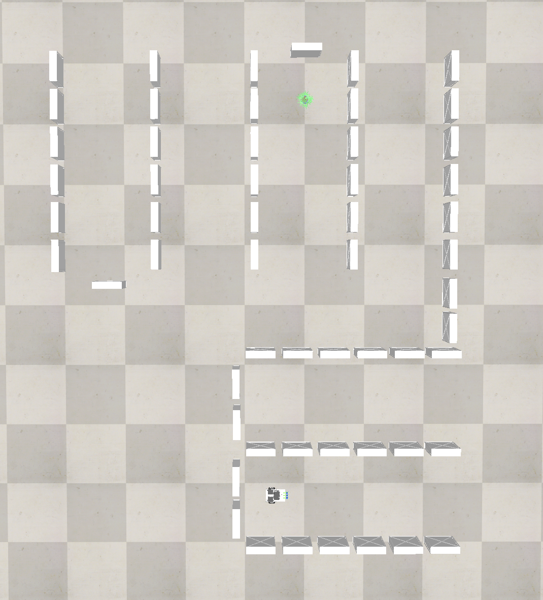
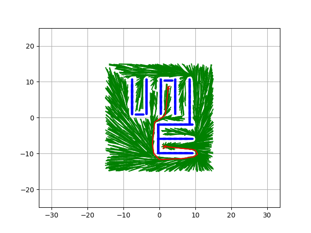
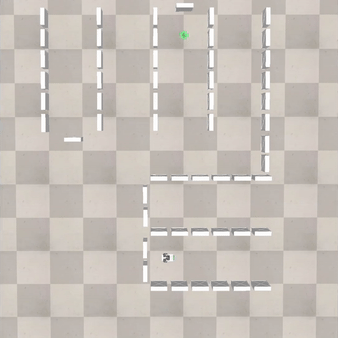
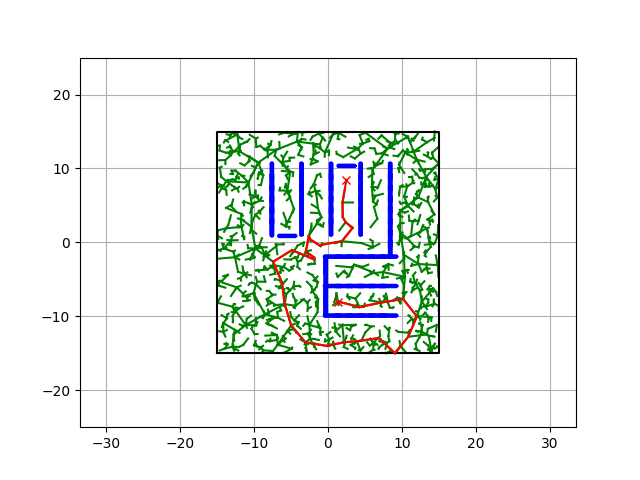
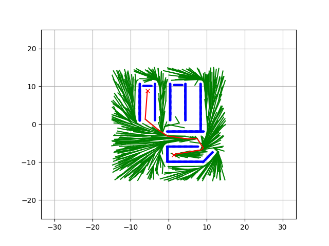

# Planning and Decision Making Project

<p float="left">
  
  
</p>

This repository contains the code and the visualisations for the project of the Planning and Decision Making course (RO47005) of the Master Robotics programme at the Technical University of Delft. The aim of this project is to use path finding algorithms to find collision free paths for a robot in a simulation environment to follow. During this project, RRT and RRT* algorithms were used for the path finding. The path was then followed by a non-holonomic differential drive mobile robot with the use of a PID controller. 

## Authors

Aden Westmaas (4825373)  
Badr Essabri (5099412)     
Denniz Goren (4495543)    
Renée Schwietert (4551753)    

## Requirements
* matplotlib==3.6.2  
* numpy==1.24.1  
* scipy==1.10.0  
* tqdm==4.64.1  
* [CoppeliaSim](https://www.coppeliarobotics.com/downloads)  

## Running the software

1. Download the [CoppeliaSim](https://www.coppeliarobotics.com/downloads) simulation environment 
2. Clone the repository  
    ```sh
    git clone https://github.com/DennizGoren/PlanningDecisionMaking.git
    ```  
3. Install required packages
   ```sh
   pip install -r requirements.txt
   ```
4. Set up a ```PYTHONPATH``` environment variable to link the CoppeliaSim API to the repository
    ```sh
   export PYTHONPATH=~/Applications/coppeliaSim.app/Contents/Resources/programming/zmqRemoteApi/clients/python
   ```
5. Load the ```scene.ttt``` file into the CoppeliaSim environment by going to File -> Open scene...
6. Make sure that there is not an active simulation in CoppeliaSim and run the following for RRT* to find a path and the simulation to start
    ```sh 
    python RobotControl.py 
    ```

## Results

### RRT* path finding algorithm  

<p float="left">
  
   
</p>

On the left we see the RRT* path finding algorithm creating paths for 4000 iterations. The paths are found based on the configuration of the simulation environment on the right. 

### Simulation of the path

<p float="left">
  
   
</p>

The shortest path that was found by the algorithm is depicted in red in left image. On the right we see the robot executing this path in the simulation environment. 

### RRT vs RRT*
<p float="left">
  
   
</p>
On the left we see the results of RRT on the same configurations as above. The result is clearly inferior to the results produced by the RRT* algorithm. The right image depicts the results of the RRT* algorithm on a different configuration of obstacles and goal. This result was produced with 1500 iterations.  

## Acknowledgments
* For the path finding algorithms, the [PythonRobotics](https://github.com/AtsushiSakai/PythonRobotics) repository by Atsushi Sakai was used. The code was modified to take the obstacles from the CoppeliaSim environment and represent them in arrays of circles that could be used by the algorithms. 


